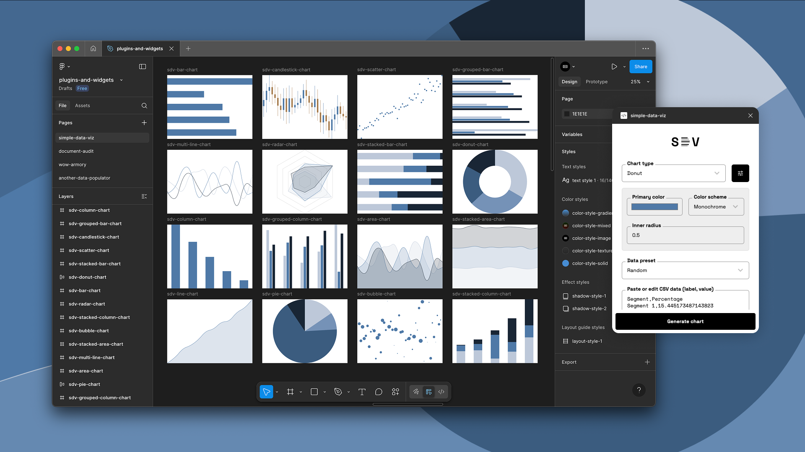

# Simple Data Viz

Simple Data Viz is a powerful yet lightweight Figma plugin that makes it easy to generate clean, customizable charts directly in your designs.

## Features

**16 Chart Types Supported**
- Bar 
- Column
- Stacked Bar
- Stacked Column
- Grouped Bar
- Grouped Column
- Pie
- Donut
- Line
- Multi-Line
- Area
- Stacked Area
- Scatter
- Bubble
- Radar
- Candlestick

**Dynamic Color Schemes**
Choose from monochromatic or polychromatic palettes, with automatic support for diverging colors and theme-aware contrast.

**Flexible Data Input**
Import data from CSV files or paste it directly from your clipboard — no formatting headaches.

**Data Presets for Every Chart Type**
Get started quickly with pre-built sample datasets tailored for each visualization style.

**Responsive Chart Sizing**
Charts automatically scale to fit your selected frame or layout in Figma.